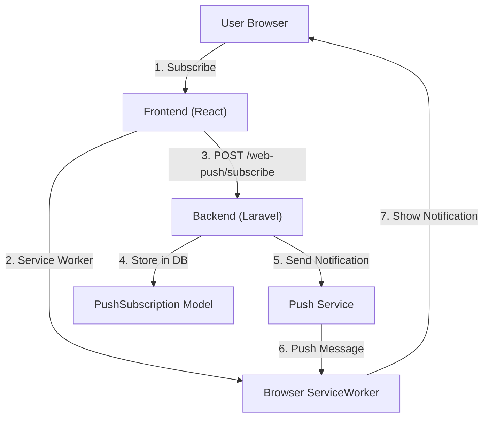

# Setup Lengkap Web Push Notifications

Dokumentasi ini menjelaskan setup lengkap untuk Web Push Notifications di Ticket App.

## Arsitektur



## File-File Penting

### Backend Files

- `app/Console/Commands/GenerateVapidKeysCommand.php` - Command untuk generate VAPID keys
- `app/Http/Controllers/PushSubscriptionController.php` - Handler untuk subscribe/unsubscribe
- `app/Models/PushSubscription.php` - Model untuk menyimpan push subscriptions
- `app/Notifications/TicketCreatedWebPush.php` - Notification kelas untuk ticket created
- `app/Notifications/TicketUpdatedWebPush.php` - Notification kelas untuk ticket updated
- `config/webpush.php` - Konfigurasi web push

### Frontend Files

- `resources/js/hooks/use-push-subscription.ts` - Hook untuk manage push subscription
- `resources/js/components/PushSubscribeButton.tsx` - Component button untuk subscribe
- `resources/js/components/NotificationBell.tsx` - Notification bell dengan push subscribe button
- `public/sw.js` - Service Worker dengan push event handler
- `resources/js/App.tsx` - Main app dengan service worker registration

### Configuration Files

- `.env` - Environment variables dengan VAPID keys

## Installation Steps

### 1. Install Dependencies

```bash
# Backend - Laravel WebPush channel
composer require laravel-notification-channels/webpush

# Frontend - dependencies sudah ada di package.json
npm install
```

### 2. Generate VAPID Keys

VAPID (Voluntary Application Server Identification) keys digunakan untuk mengidentifikasi server Anda ke push service.

```bash
php artisan webpush:vapid --show
```

Akan menampilkan:

```
VAPID Keys:

Public Key:
BLx3GbaMoUG3_20K-nzJqVFM8gMz38LqGN2DvmKHmfUvqNP9vbFfZSB_mQHKLAhE3CxN5tZ6vD4mK8pQ9K2K8nw

Private Key:
gJ9K2nL5mO8pR3sT6vW9xY2zAb5cD8eF1gH4iJ7kL0mN3oP6qS9tU2vX5yZ8aB1c
```

### 3. Update .env File

Copy keys dari output di atas ke `.env`:

```env
# Public key untuk frontend
VITE_VAPID_PUBLIC_KEY=BLx3GbaMoUG3_20K-nzJqVFM8gMz38LqGN2DvmKHmfUvqNP9vbFfZSB_mQHKLAhE3CxN5tZ6vD4mK8pQ9K2K8nw

# Keys untuk backend
VAPID_PUBLIC_KEY=BLx3GbaMoUG3_20K-nzJqVFM8gMz38LqGN2DvmKHmfUvqNP9vbFfZSB_mQHKLAhE3CxN5tZ6vD4mK8pQ9K2K8nw
VAPID_PRIVATE_KEY=gJ9K2nL5mO8pR3sT6vW9xY2zAb5cD8eF1gH4iJ7kL0mN3oP6qS9tU2vX5yZ8aB1c
```

### 4. Database Migration

```bash
# Create table untuk push subscriptions
php artisan migrate
```

Table structure:

```sql
CREATE TABLE push_subscriptions (
    id BIGINT PRIMARY KEY AUTO_INCREMENT,
    user_id BIGINT NOT NULL,
    endpoint VARCHAR(500) UNIQUE NOT NULL,
    endpoint_hash VARCHAR(64) UNIQUE NOT NULL,
    public_key TEXT NOT NULL,
    auth_token TEXT NOT NULL,
    content_encoding VARCHAR(50),
    created_at TIMESTAMP,
    updated_at TIMESTAMP,
    FOREIGN KEY (user_id) REFERENCES users(id) ON DELETE CASCADE
);
```

### 5. Build Frontend

```bash
npm run build
```

## Usage

### Subscribe ke Push Notifications

Di frontend, user bisa click tombol "Aktifkan Notifikasi" di notification bell dropdown. Component akan:

1. Request permission ke browser
2. Get push subscription dari ServiceWorker
3. POST subscription details ke `/web-push/subscribe`
4. Server menyimpan ke database

### Send Push Notification dari Backend

```php
use App\Models\User;
use App\Notifications\TicketCreatedWebPush;

$user = User::find(1);
$ticket = Ticket::find(1);

// Send notification
$user->notify(new TicketCreatedWebPush($ticket));
```

### Push Notification Flow

1. **User subscribes** → Browser mempunyai subscription details
2. **POST /web-push/subscribe** → Backend menyimpan subscription
3. **Ticket created event** → Backend sends notification
4. **Notification queued** → Database queue atau sync
5. **WebPush channel sends** → Hits push service dengan VAPID signature
6. **Push service delivers** → Sends message ke browser
7. **Service Worker receives** → `push` event triggered
8. **Show notification** → User notified

## Troubleshooting

### Service Worker tidak register

Check:

```javascript
// In browser console
navigator.serviceWorker.getRegistrations();
```

### Push notification tidak diterima

Check:

1. Browser support - Test di Firefox/Chrome yang modern
2. VAPID keys - Pastikan public key ada di `import.meta.env.VITE_VAPID_PUBLIC_KEY`
3. Subscription - Check database `push_subscriptions` table
4. Queue - Pastikan queue worker berjalan jika menggunakan async

### "notifikasi tidak didukung di peramban ini"

Browser Anda tidak mendukung Push API atau Service Worker. Test di:

- Chrome/Edge 50+
- Firefox 48+
- Opera 37+

Tidak support:

- Safari (iOS)
- IE / Edge Legacy

## Configuration Details

### config/webpush.php

```php
return [
    'public_key' => env('VAPID_PUBLIC_KEY'),
    'private_key' => env('VAPID_PRIVATE_KEY'),
    'web_push' => [
        'ttl' => 86400,      // 24 hours
        'urgency' => 'normal', // normal, high, low
        'topic' => env('APP_NAME', 'TicketApp'),
    ],
];
```

### Service Worker Push Handler

Service Worker mendengarkan `push` event dan display notification:

```javascript
self.addEventListener('push', (event) => {
    const data = event.data.json();
    // Show notification dengan custom options
});

self.addEventListener('notificationclick', (event) => {
    // Handle click - open app ke ticket page
});
```

## Security Considerations

1. **VAPID Private Key** - Jangan share atau commit ke repository
2. **.env file** - Tambahkan ke `.gitignore`
3. **Endpoint URL** - Subscription endpoints unique per device
4. **HTTPS Required** - Push API hanya works di HTTPS (production) atau localhost (dev)

## Advanced Features

### Custom Notification Actions

```php
public function toWebPush($notifiable, $notification)
{
    return (new WebPushMessage)
        ->title("Tiket baru")
        ->body("Ada tiket baru untuk Anda")
        ->action('view', 'Lihat', '/tickets/1')
        ->action('snooze', 'Nanti', null);
}
```

### Batch Notifications

```php
// Send ke multiple users
foreach ($users as $user) {
    $user->notify(new TicketCreatedWebPush($ticket));
}
```

### Check Subscription Status

```typescript
const { isSubscribed } = usePushSubscription();
const subscribed = await isSubscribed();
```

## Testing

### Manual Test

1. Build: `npm run build`
2. Serve: `php artisan serve`
3. Open: http://localhost:8000
4. Click "Aktifkan Notifikasi" di notification bell
5. Grant permission
6. Check database: `SELECT * FROM push_subscriptions WHERE user_id = 1`
7. Send test notification dari backend

### Browser DevTools

```javascript
// Open console and test subscription
navigator.serviceWorker.ready.then((reg) => {
    reg.pushManager.getSubscription().then((sub) => {
        console.log(sub);
    });
});
```

## Next Steps

1. ✅ VAPID keys configured
2. ✅ Service worker with push handler
3. ✅ Frontend push subscription
4. ✅ Backend PushSubscriptionController
5. ✅ Notification classes untuk tickets
6. TODO - Test push notifications end-to-end
7. TODO - Add notification settings per user
8. TODO - Schedule notifications
9. TODO - Analytics untuk notification engagement
